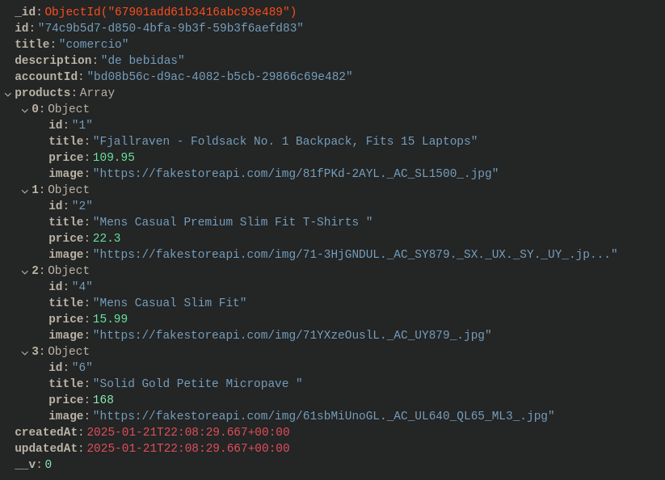
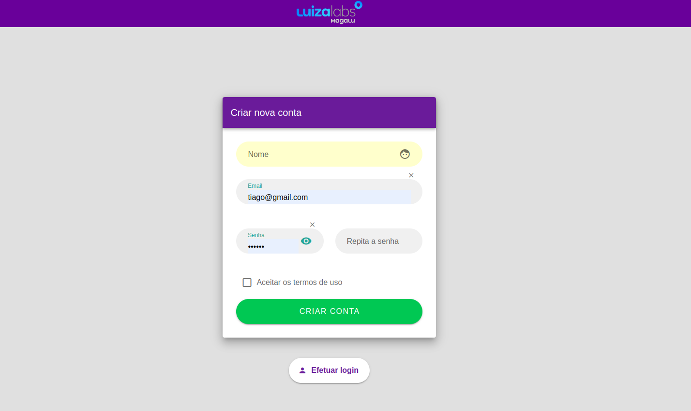
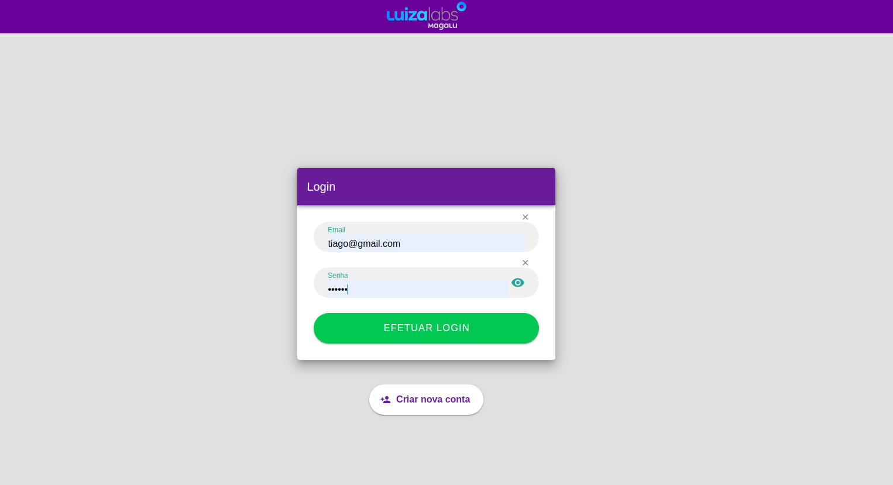
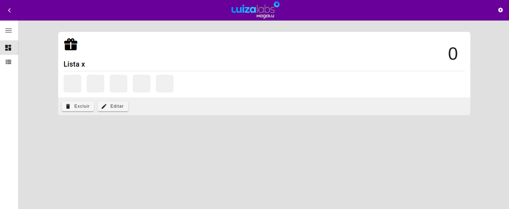
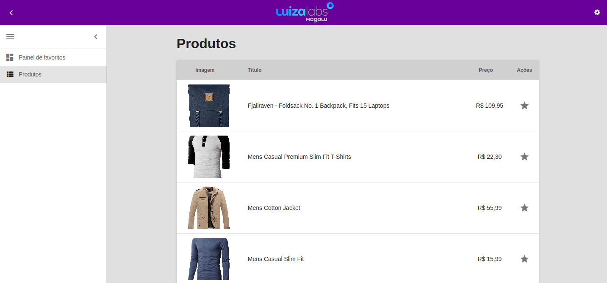
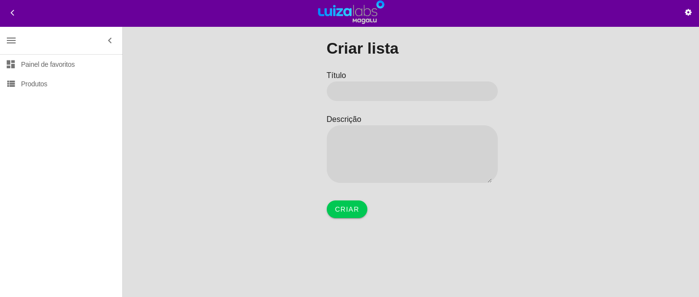
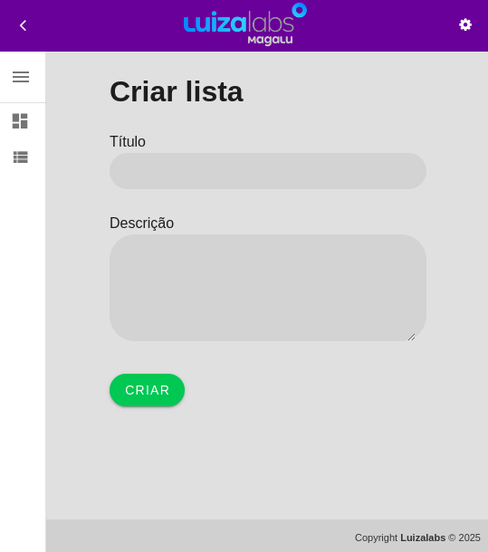
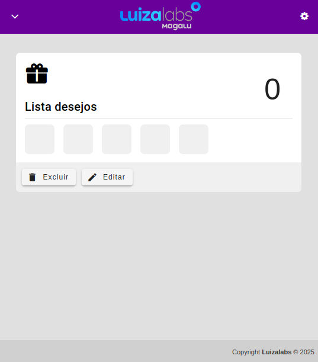
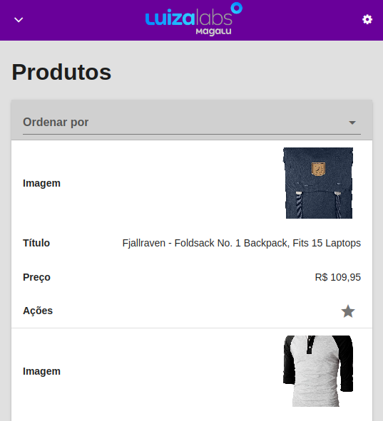

# Luizalabs - Desafio

> **Desafio Luizalabs** é uma aplicação para inserção de produtos a lista de favoritos.<br />

<p align="center"></p>

## 👤 Autor

| Nome                                              | Ativo | Dt. inativo | Atribuições   |
| ------------------------------------------------- | ----- | ----------- | ------------- |
| [Enéas Almeida](https://github.com/eneas-almeida) | 🔥    | -           | Desenvolvedor |

## ⚓ Links

👉 [Backend](https://github.com/eneas-almeida/luizalabs-backend)<br />
👉 [Frontend](https://github.com/eneas-almeida/luizalabs-frontend)

**Observação**: Em cada repositório contém as instruções necessárias de como rodar tanto o backend quanto o frontend.

## Etapas do projeto

1. Entendimento do problema a ser resolvido;
2. Levantamento dos requisitos funcionais;
3. Definição do padrão arquitetural utilizado;
4. Definição das tecnologias utilizadas;
5. Definição das atribuições e cronograma de estimativas no desenvolvimento das atividades;
6. Desenvolvimento do MVP.<br />
   6.1. Desenvolvimento da backend;<br />
   6.2. Desenvolvimento do frontend;<br />
   6.3. Integração do frontend com o backend.

## Backend

<p align="left">
  
  
  
</p>

-   NodeJs/Express
-   Javascript
-   Docker/Mongo
-   Testes com métricas de coverages (**Jest**)

### Clean Architecture

A escolha do padrão **Clean Architecture** para um projeto de software pode trazer diversos benefícios, mas é importante ressaltar que a escolha de uma arquitetura depende muito das necessidades específicas do projeto, das características da equipe de desenvolvimento e das metas a serem alcançadas.

**Principais vantagens:**

-   Separação de responsabilidades;
-   Independência de frameworks e bibliotecas;
-   Testabilidade;
-   Escalabilidade;
-   Longevidade do software.

### Recursos utilizados no backend

-   Testes unitários;
-   Tipagem com o JDOCS;
-   Injeções e inversões de dependência;
-   Adaptador para as API de produtos (fakestore);
-   Padrão repository;
-   Estratégia de resiliência de chamadas http com o axios retry;
-   Estratégia de melhor gerencimanto do pool de conexões com o agentkeepalive;
-   Indexes nas collections do mongo.

### Recursos futuros

-   RateLimit
-   Swagger
-   CI/CD

### Persistência dos dados

<p align="left">
  
  
</p>

-   MongoDB

\* O banco de dados é proveniente de container do docker.

Estrutura de um registro de lista de produtos no mongo:



## Frontend

<p align="left">
  
  
   
</p>

-   VueJs
-   Vuetify
-   Javascript

### Prints do sistema

















## Recursos

| Path                     | Método | Token | Descrição                               |
| ------------------------ | ------ | ----- | --------------------------------------- |
| http://localhost:3000/v1 |
| **ACCOUNT**              |
| /accounts/create         | POST   |       | Cria a conta                            |
| /accounts/login          | POST   |       | Efetua login                            |
| **FAVORITES**            |
| /favorites               | POST   | x     | Cria lista de produtos favoritos        |
| /favorites/:id           | DELETE | x     | Deleta lista de favoritos               |
| /favorites               | GET    | x     | Lista a lista de favoritos              |
| /favorites/:id           | GET    | x     | Visualiza a lista de favoritos          |
| /favorites/:id           | PUT    | x     | Atualiza os dados da lista de favoritos |
| /favorites/manager       | PATCH  | x     | Gerencia a lista de favoritos           |
| **PRODUCTS**             |
| /products                | GET    | x     | Obtém os produtos                       |

## Download do projeto no Insomnia

[](https://insomnia.rest/run/?label=Luizalabs&uri=https%3A%2F%2Fraw.githubusercontent.com%2Feneas-almeida%2Fluizalabs%2Fmaster%2./media/insomnia/Insomnia_2025-01-18.json)

## Gitflow

<p align="center">
    
</p>

O Gitflow é um fluxo de trabalho que auxilia o desenvolvimento contínuo de software entre a equipe envolvida.

👉 <a href="https://www.atlassian.com/br/git/tutorials/comparing-workflows/gitflow-workflow">Mais informações</a>

\* A branch **master** 🔒 é bloqueada para receber commits de usuários.<br /> \* A branch **master** representa o software em **produção**.<br /> \* A branch **develop** representa o software em **QA**.<br /> \* Fica determinado que sempre que um merge request na branch develop for aprovado ou reprovado, a branch do usuário **NÃO** será deletada, a fim de manter o histórico de branchs.

## Conventional Commits

**Conventional Commits** é uma convenção de mensagens de commits. Essa convenção descrevendo os recursos, correções e alterações importantes feitas nas mensagens.

### Flags utilizadas:

| Ícone | Flag         | Descrição                                                                                                |
| ----- | ------------ | -------------------------------------------------------------------------------------------------------- |
| 🪲    | **fix**      | Correção de bug para o usuário.                                                                          |
| ☂️    | **feat**     | Desenvolvimento de uma nova funcionalidade.                                                              |
| 📃    | **docs**     | Alterações na documentação.                                                                              |
| ✂️    | **refactor** | Refatoração de um bloco de código.                                                                       |
| 💅    | **style**    | Formatação, falta de ponto e vírgula, etc.                                                               |
| 🔧    | **perf**     | Uma mudança de código que melhora o desempenho.                                                          |
| 🔨    | **build**    | Alterações que afetam o sistema de compilação ou dependências externas (escopos de exemplo: gulp e npm). |
| 🪀    | **ci**       | Alterações em arquivos e scripts de configuração de CI (escopos de exemplo: Travis, Circle e Codeship).  |
| 🧪    | **test**     | Adicionando testes ausentes ou corrigindo testes existentes.                                             |

### Exemplos de commits utilizando a padronização

```bash
# Exemplo 1
git commit -m "🪲 fix: corrige bug da listagem de usuários."
```

```bash
# Exemplo 2
git commit -m "☂️ feat: cria o módulo de pontos."
```

<hr>

© Documento elaborado por <a href="https://github.com/eneas-almeida">Enéas Almeida</a>.
